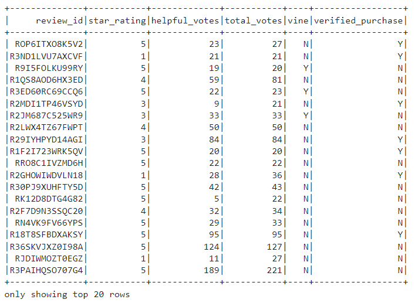
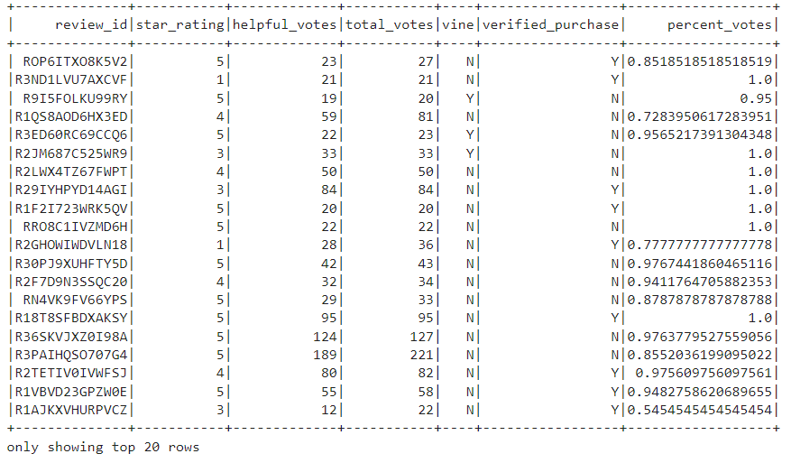
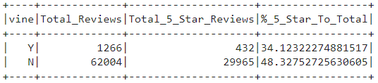

# Amazon Vine Analysis
An analysis of Amazon Toy reviews by Amazon Vine members and Non-Vine Members.

## Overview of the Analysis
The goal of this analysis is to compare Amazon reviews made by Amazon Vine members against reviews made by Non-Vine members. Amazon Vine is a program where invited members request, then recieve free products in exchange for an honest review. The purpose of our analysis is to determine if there is a bias in reviews left by Amazon Vine members who recieved products to review, versus Non-Vine members who found, purchased, and reviewed the products on their own. For this analysis, I chose to analyze the toy data from Amazon.

## Results
The original dataset had a massive amount of reviews so we added parameters to make the data manageable.
- First, we created a table where all the rows showed were where the Total Votes count is equal to or greater than 20.

- Second, we created a table where where the number of Helpful Votes divided by Total Votes is equal to or greater than 50%.

#### How many Vine reviews and non-Vine reviews were there?
- There were 1266 Vine members compared to 62004 Non-Vine Members.

#### How many Vine reviews were 5 stars? How many non-Vine reviews were 5 stars?
- 432 Vine Member reviews were five stars.
- 29965 Non-Vine Member reviews were five stars.

#### What percentage of Vine reviews were 5 stars? What percentage of non-Vine reviews were 5 stars?
- 34.12% of Vine Member reviews were five stars.
- 48.33% of Non-Vine Member reviews were five stars.

## Summary
Based of the Vine Members to Non-Vine member review percentages, there did not seem to be an overwhelming bias left by Amazon Vine Members. The five star reviews left by Vine Members was about 15% less than the five star reviews left by Non-Vine Members. This may be that Vine-Members show more criticism while using their product and more thought into their final review. We could get a more in-depth analysis by filtering the reviews by only those with a verified purchase to guarantee through Amazon. This could guarantee that the Non-Vine Member reviews are from actual customers and not "paid reviews" bought by the toy company to fluff a five star rating.
